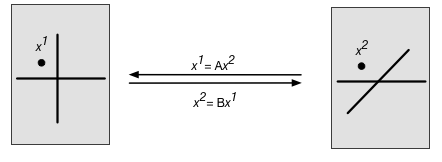
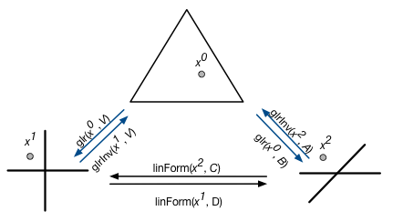
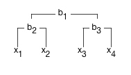

```{r, include = FALSE}
knitr::opts_chunk$set(
  collapse = TRUE,
  comment = "#>"
)
```

# Introduction
My work on the [*stray* project](https://jsilve24.github.io/stray/) made it clear
to me that there is a need for an extreemly fast library for compositional data
analysis (CoDA) that provides both R and C++ interfaces. Beyond speed, I realized that
existing CoDA libraries such as the [*compositions*](https://CRAN.R-project.org/package=compositions ) package do not support some of the key functionality I required. Notably, I wanted to be able to easily work with compositional arrays and compositional covariance matricies as I outline below. 
RcppCoDA solves these problems. 

Still I do not intend RcppCoDA to be a one-stop shop for all CoDA needs. For example, 
the *compositions* package has some really nice functions for plotting compositional data
and doing PCA. Rather than reinvent the wheel my intent was to make RcppCoDA a minimal 
framework for implementing the most computationally challenging parts of compositional 
data analysis to support other packages such as *compositions* or *stray*. Still, 
much of the day-to-day CoDA needs such as transformations, changes of representations etc... 
can all be done easily using the R interface for RcppCoDA. 

The design principles underlying RcppCoDA are simple yet require I present 
CoDA in a slightly different light than I have seen in prior works. Note, the intention of the next section is not to serve as an introduction to CoDA, books like [*Modeling and Analysis of Compositional Data Analysis*](https://www.wiley.com/en-us/Modeling+and+Analysis+of+Compositional+Data-p-9781118443064) already do a wonderful job of this. Instead, this is inteded as a systematized look at 
the field for those already loosely familiar with the motivation and uses of CoDA.

**A hint when reading this document:** The next section is a high-level 
overview of compositional data and some of the backbone functions of RcppCoDA. This overview 
should help make the interface for RcppCoDA intuitive as well as giving the necessary background
to take advantage of some of the really powerful features of this package. However, if you are in a rush and asking something like "just tell me what the interface for the inverse ALR transform looks like" then just skip down to the section "Shortcuts for the Standard Transforms in RcppCoDA". 

Note, this package makes use of the standard math convention that multivariate vectors 
are columns; e.g., we assume a sample in a dataset is a column rather than a row. 

# A systematized look at Compositional Data Analysis (CoDA)

## Compositional Vectors
CoDA is all about the analysis of compositional data, data consisting of multivariate
vectors summing to a constant value. For example, we call a vector $x$ a composition if 
$x^0\in \mathcal{S}^D$ where
$$\mathcal{S}^D = \left\{ x^0 =  [x^0_1, \dots, x^0_D] \text{ s.t. } x_i>0, i=1, \dots, D; \sum_{i=1}^D x^0_i= \kappa \right\}.$$
Typically we take $\kappa=1$ which then means that $\mathcal{S}^D$ is the space of D-dimensional proportions (if $\kappa=100$ then we call it the space of percentages, etc...). 

CoDA at its heart is all about the representation of these vectors $x^0$. At this point I need to take a brief step backwards and explain what I mean by vectors and representations. Rather than talking about data existing in a space lets talk about a smudge (black dot) on a flat tablecloth (grey rectangle).



Imagine I want to give coordinate for the smudge on the table cloth. There turns out to be an infinite
number of different coordinate systems I could choose. For example, in the above figure
I show the same table cloth with a smudge in the same place but with two different coordinate systems. 
The two coordinate systems lead to different coordinates for the smudge $x^1$ and $x^2$ respectively but
in both cases the vector (smudge) they represent is identical. Assuming these two coordinate systems
have the origin at the same point in the table-cloth then we can describe the relationship between 
the coordinates of the smudge as a linear form, where $A$ and $B$ are just real valued matrices. 

So back to what I was saying, compositional data is about about alternative representations for 
a compositional vector $x$ and the main goal of RcppCoDA is to make it easy to transform coordinates between representations such that the transformed coordinates still represent the same object. CoDA is just slightly more complicated than the above example because beyond linear transformations bewteen cooridinate systems we also need non-linear transformations to transform compositional vectors
back and forth from a representation in the simplex (e.g., as proportions) to real space (e.g., as log-ratios). 



In the above figure $x^0$, $x^1$, and $x^2$ all represent the same compositional 
vector but in three different representations. I am also starting to introduce some of the 
functions that are used in RcppCoDA. I will start with the blue arrays, the non-linear transformations 
between proportions and different log-ratio representations. 

### The Genearlized Log-Ratio Transform
You have probably heard about different log-ratio transformations (e.g., the CLR, the ALR, the ILR), it turns out they are all examples of the same general transformation which I call the GLR (generalized log-ratio) but with different choices of contrast matrices. The GLR transformation defined by contrast matrix $A$ can be written 
$$x^1 = \text{glr}(x^0, A) = A\log x^0$$
where $\log x$ refers to the elementwise logarithm (base $e$ in RcppCoDA) with inverse given by 
$$x^0=\text{glrInv}(x^1, B) = \mathcal{C}(\exp \left\{B^Tx^1\right\})$$
for some matrix $B$ and where $\exp\{x\}$ denotes the elementwise exponentiation (base $e$) of $x$ and $\mathcal{C} denotes the closure operation defined by 
$$ \mathcal{C}(x) = \left( \frac{x_1}{\sum_i x_i}, \dots, \frac{x_D}{\sum_i x_i} \right) .$$
Each of the different transformations are defined by different $A$ and $B$ matricies. RcppCoDA makes contrast matrices corresponding to the ILR, ALR, and CLR readily available with the functions `ilrContrast`, `alrContrast`, and `clrContrast` respectively.^[Note that only 
when $A$ is an orthogonal matrix is $B$ trivially equal to $A$; in this case the defined transformation is called an ILR transform.]

In RcppCoDA the Closure operation is implemented as the function `clo`. The GLR and its inverse are implemented as `glr` and `glrInv` respectively. 

### Transformations Between Log-Ratio Representations

It turns out that transforming a vector between any two log-ratio representations is just a linear transformation; *e.g.,*
$$x^1 = \text{linForm}(x^2, C)  = Cx^2$$
for some matrix $C$ which I call a *transfer matrix*. 
However, it is not always simple to calculate the transfer matrix (please note, that is not "x squared" its the "x two" representation of $x$). Later in this document 
I will review key functions that calculates transfer matrices when moving between the standard log-ratio representations (e.g., ALR to ILR etc...).

## Compositional Covariance Matricies

When teaching or discussing CoDA most people just talk about transforming compositional vectors. Yet, there are other types of compositional "objects" that we often want to be able to transform between representations. Let me motivate this with an example. Suppose we have two random compositional vectors $x$ and $y$ (*e.g.*, the composition of microbes in the human gut before and after taking an antibiotic).
We may want to evaluate the covariation between $x$ and $y$. Often in CoDA we do this by representing 
$x$ and $y$ in a log-ratio coordinate system such that we have $x^1$ and $y^1$ and we end up calculating the covariance matrix $\Sigma^1 = cov(x^1, y^1)$. We call $\Sigma^1$ a compositional covariance matrix
because it is representing the covariance between compositional random vectors. It turns out 
that if we change the representation then the covariance matrix must also change in order to keep the object being represented the same (just like with the smudge on the table cloth). 

### Transformations Between Log-Ratio Representations
Simple right? But lets say that we want to change the representation from $\Sigma^1 = cov(x^1, y^1)$ to a second log-ratio representation $\Sigma^2 = cov(x^2, y^2)$. How are $\Sigma^1$ and $\Sigma^2$ related? It turns out that, rather than a linear form `linForm` as was the case for vectors, now we have a quadratic form `quadForm` where for some transfer matrix $C$ we have 
$$\Sigma^2 = \text{quadForm}(\Sigma^1, C) = C\Sigma^1C^T.$$
Conveniently it turns out that $C$ only depends on the two representations not on the fact we are transforming covariance matricies, therefore the same transfer matrix can be used to transform the representation of covariance matricies as can be used (albeit with `linForm`) to transform the representation of vectors. 


### Transformations to and from the simplex

Lets say that $\Sigma^0 = cov(x^0, y^0)$ where as before $x^0$ and $y^0$ are our 
compositional random vectors but now represented as proportions. Unfortuantely, because
of the non-linear transform needed to transform between log-ratios and the simplex, there are no
simple transformations relating $\Sigma^0$ and $\Sigma^1$ or $\Sigma^2$. If your wondering
why you can't find them in RcppCoDA its beause they are not there, this is an fruitful area for future research. 

# Shortcuts for the Standard Transforms in RcppCoDA

The last section was very high-level, talking about all of compositional data analysis
in general terms. Still, much of compositional data analysis comes down to three main families of transforms: the Centered Log-Ratio (CLR), the Additive Log-Ratio (ALR), and the Isometric Log-Ratio (ILR) transforms. RcppCoDA implements a number of shortcuts for CoDA using these three families of transforms. 

## The Shorthand Parameters of Standard Transforms

Let $x$ represent a D-dimensional compositional vector. For the ALR and CLR transforms
we can use short-hands to specify the transform, without having to specify the full contrast
matrix for the GLR. Just for my own sanity, here I will only give the "forward" transforms
from the simplex to real space, the inverse transformatins are straight forward to calculate. 

To demonstrate lets simulate some data:
```{r}
library(RcppCoDA)
set.seed(493912)

# Simulate 5 samples of 4 part compositions. 
X <- matrix(abs(rnorm(20)), 4,5)
(X <- clo(X))
```


### The ALR Transforms
The ALR has a single paramter $d$ representing which of the $D$ dimensions is
taken as reference. The ALR is a transform from $\mathcal{S}^D\rightarrow \mathcal{R}^{D-1}$.
$$\text{ALR}_d(x) = \left(\log \frac{x_1}{x_d}, \dots, \log \frac{x_{d-1}}{x_d}, \log \frac{x_{d+1}}{x_d}, \dots, \log \frac{x_{D}}{x_d} \right)$$
```{r}
# Take ALR Transform of X with respect to the third part
(X.alr <- alr(X, d=3))

# Transform X.alr back into the simplex, should be equal to X, 
# note here we specify the same part d=3 to create the correct inverse transform
alrInv(X.alr, d=3)
```

In RcppCoDA, the default ALR transform is when $d=D$ (i.e., the last part is taken as reference). 
```{r}
(X.alr <- alr(X)) # this is equivalent to alr(X, d=nrow(X))
alrInv(X.alr) # this is equivalent to alr(X.alr, d=nrow(X))
```


### The CLR Transform
There is a single CLR transform, therefore no parameters are required. In the CLR transform the geometric mean is taken as reference. The CLR tranform is a transform from $\mathcal{S}^D\rightarrow \mathcal{R}^{D}$.
$$\text{CLR}(x) = \left(\log \frac{x_1}{(\prod_i x_i)^{1/D}}, \dots, \log \frac{x_D}{(\prod_i x_i)^{1/D}} \right)$$
```{r}
(X.clr <- clr(X))
clrInv(X.clr)
```


### The ILR Transform
The ILR tranform is a GLR tranform where $V$ is a $D-1$ dimensional orthonormal basis. It is therefore not too helpful to write out any shorthand for the ILR beyond the GLR transform already given above. 
The default ILR transform in RcppEigen is given in Exmaple 4.6 of *Modleing And Analysis of Composition Data*, it is a $D-1 \times D$ matrix which for each $i\in\{1, \dots, D-1\}$ the entries are given by 
$$V_{ij} = \begin{cases}\sqrt{\frac{1}{(D-1)(D-i+1)}}&\text{if } j\leq D-i \\
-\sqrt{\frac{D-i}{D-i+1}}& \text{if } j=D-i+1 \\
0 &\text{otherwise}
\end{cases}$$
```{r}
# Here we just demonstrate the default, if there is a specific contrast matrix 
# you want to use you can pass it as a parameter V
(X.ilr <- ilr(X))
ilrInv(X)
```

I will save my larger conversation about Contrast matricies in RcppCoDA to the next subsection but
I should mention a bit about ILR contrast matrices. Many reserachers like to use a 
sequential binary partition (SBP) to define a specific ILR. For example, consider the following
SBP. 



This SBP can be encoded as a sign matrix:
$$
S = \begin{bmatrix}
1 & 1 & -1 & -1 \\
1 & -1 & 0 & 0 \\
0 & 0 & 1 & -1 
\end{bmatrix}
$$

The function `ilrContrast` can take two different types of arguments. 
```{r}
S <- rbind(c(1,1,-1,1), c(1,-1, 0, 0), c(0, 0, 1, -1))
```

There are also a subset of ILR transforms which correspond to a sequential binary partition (SBP). RcppCoDA provides a function `ilrContrast` which, if passed an integer will build the default ILR contrast of that dimension, otherwise if passed a sign matrix encoding an SBP it will produce a contrast matrix corresponding to that SBP. 


# The Contrast Matricies

# The Transfer Matrices


```{r setup}

```
